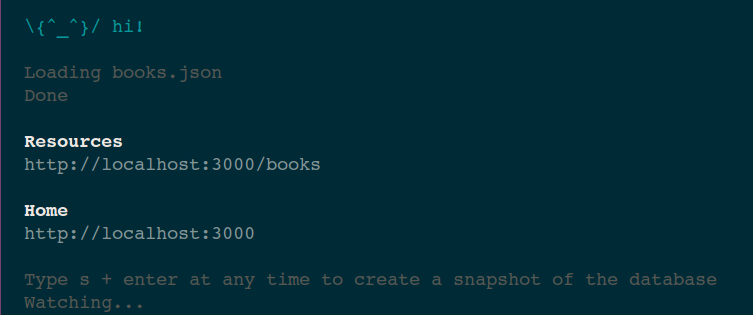

A [Giter8][g8] template for showcasing the use of STTP and JSON Server!

STTP Example using JSON Server
---

This giter8 template is showcasing the use of STTP and JSON server.

To get the templates: 

```bash
sbt new knoldus/sttp-example.g8
```

**sttp** is an open-source library which provides a clean, programmer-friendly API to define HTTP requests and execute them using one of the wrapped backends, such as akka-http, async-http-client or OkHttp.

**JSON Server** is a project that helps you to setup a REST API within seconds.

**Install JSON Server**

JSON Server is available as a NPM package. The installation can be done by using the Node.js package manager:

```shell
$ npm install -g json-server
```

**JSON File for json-server**

We need a json file in order to create rest end point. Example file is included in `src/main/resource/book.json`

**Start Json Server**

To start json server execute the following command:

```bash
$ json-server --watch src/main/resources/books.json
```



To know more about JSON Server please visit: https://jsonplaceholder.typicode.com/


Template license
----------------
Written in 2017 by Himani Arora

To the extent possible under law, the author(s) have dedicated all copyright and related
and neighboring rights to this template to the public domain worldwide.
This template is distributed without any warranty. See <http://creativecommons.org/publicdomain/zero/1.0/>.

[g8]: http://www.foundweekends.org/giter8/